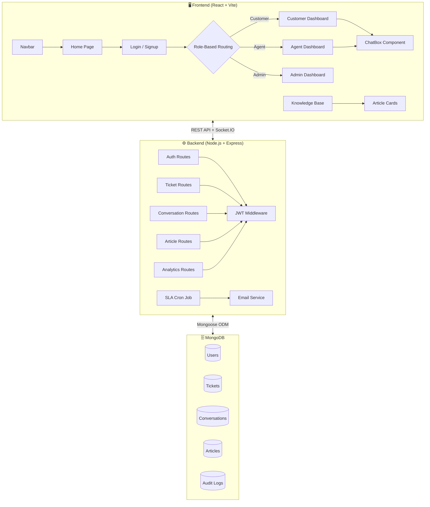
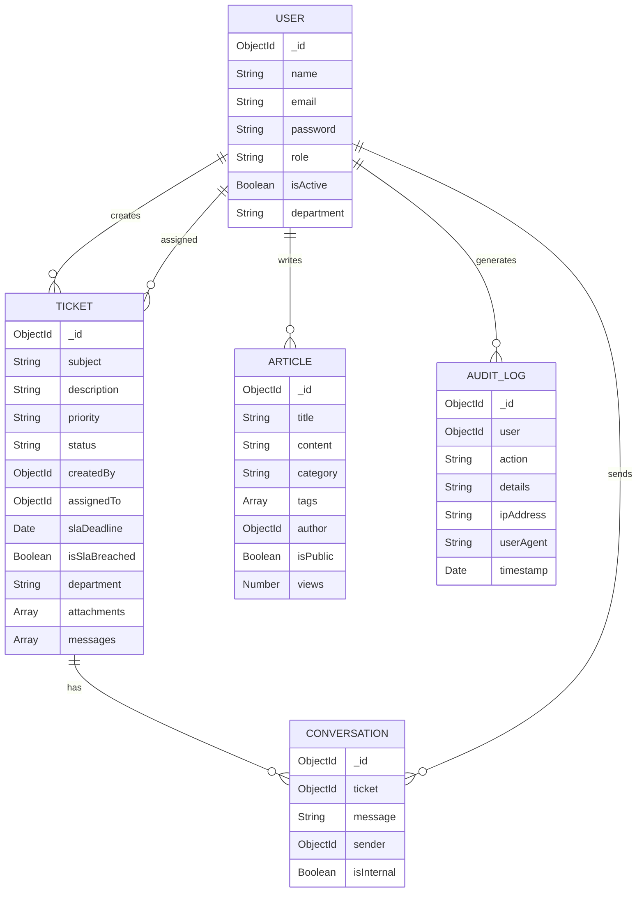

<p align="center">
  
</p>

<p align="center">
  <a href="#-features"></a>
  <a href="#-tech-stack"></a>
  <a href="#-quick-start"></a>
  <a href="#-team"></a>
</p>

<p align="center">
  
  
  
  
  
  
</p>

<br/>

<p align="center">
  <picture>
    <source media="(prefers-color-scheme: dark)" srcset="https://raw.githubusercontent.com/platane/snk/output/github-contribution-grid-snake-dark.svg" />
    <source media="(prefers-color-scheme: light)" srcset="https://raw.githubusercontent.com/platane/snk/output/github-contribution-grid-snake.svg" />
    
  </picture>
</p>

---

## 📋 Table of Contents

<details open>
<summary><b>Click to expand/collapse</b></summary>

- [🌟 About the Project](#-about-the-project)
- [✨ Features](#-features)
- [🖥️ Dashboard Views](#️-dashboard-views)
- [🏗️ Architecture](#️-architecture)
- [⚡ Tech Stack](#-tech-stack)
- [📁 Folder Structure](#-folder-structure)
- [🚀 Quick Start](#-quick-start)
- [🔌 API Endpoints](#-api-endpoints)
- [🗄️ Database Models](#️-database-models)
- [🔐 Authentication & Roles](#-authentication--roles)
- [📊 Analytics Dashboard](#-analytics-dashboard)
- [💬 Real-Time Chat](#-real-time-chat)
- [⏰ SLA Monitoring](#-sla-monitoring)
- [📚 Knowledge Base](#-knowledge-base)
- [🤝 Contributing](#-contributing)
- [👥 Team](#-team)
- [📄 License](#-license)

</details>

---

## 🌟 About the Project

<table>
<tr>
<td width="60%">

**IBM HelpDesk** is a full-stack, enterprise-grade **support ticket management system** built for the IBM SkillsBuild Internship Program. It enables organizations to efficiently manage customer support through an intelligent ticketing workflow, real-time communication, SLA monitoring, and rich analytics.

The system features **three role-based dashboards** (Customer, Agent, Admin), a centralized **Knowledge Base**, and **real-time Socket.IO-powered chat** — all wrapped in a beautifully animated, responsive UI built with React and Framer Motion.

</td>
<td width="40%">

```
  ╔══════════════════════════╗
  ║   🎫 IBM HelpDesk        ║
  ║                          ║
  ║  ┌────────┐ ┌────────┐   ║
  ║  │Customer│→│ Ticket │   ║
  ║  └────────┘ └───┬────┘   ║
  ║                 │        ║
  ║  ┌────────┐ ┌───▼────┐   ║
  ║  │ Agent  │←│ Assign │   ║
  ║  └────────┘ └───┬────┘   ║
  ║                 │        ║
  ║  ┌────────┐ ┌───▼────┐   ║
  ║  │ Admin  │→│Resolved│   ║
  ║  └────────┘ └────────┘   ║
  ╚══════════════════════════╝
```

</td>
</tr>
</table>

---

## ✨ Features

<table>
<tr>
<td>

### 🎫 Ticket Management
- Create, view, and track support tickets
- Priority levels: `LOW` `MEDIUM` `HIGH` `URGENT`
- Status workflow: `OPEN` → `IN_PROGRESS` → `RESOLVED` → `CLOSED`
- File attachment support (via Multer)
- Department-based ticket routing

</td>
<td>

### 💬 Real-Time Communication
- Socket.IO-powered live chat per ticket
- Instant message delivery & notifications
- Internal notes (agent-only visibility)
- Optimistic UI updates for smooth UX

</td>
</tr>
<tr>
<td>

### 📊 Analytics & Reports
- Interactive charts (Pie, Bar, Line) via Recharts
- Status distribution visualization
- Priority breakdown histogram
- Ticket trend analysis (last 7 days)
- Real-time stat cards with animated counters

</td>
<td>

### ⏰ SLA Enforcement
- Automated SLA deadline tracking
- Cron-based breach detection (hourly)
- Email escalation to Admins & Managers
- Visual breach indicators (⚠️) on tickets
- Auto-notification to assigned agents

</td>
</tr>
<tr>
<td>

### 📚 Knowledge Base
- Searchable article repository
- Category filtering (General, Technical, Billing, etc.)
- Role-based article publishing (Admin/Agent)
- Text-indexed search for fast lookups
- Animated card-based article browser

</td>
<td>

### 🔐 Security & Audit
- JWT-based authentication
- Bcrypt password hashing
- Role-based access control (RBAC)
- Comprehensive audit logging
- IP & User-Agent tracking

</td>
</tr>
</table>

---

## 🖥️ Dashboard Views

<div align="center">

### 🏠 Home Page
</div>

> The landing page features a **Lottie-animated hero section** with smooth Framer Motion transitions, inviting users to explore the platform.

```
┌─────────────────────────────────────────────────────────┐
│  🔗 HelpDesk    Home  Knowledge Base   Login  Sign Up   │
├─────────────────────────────────────────────────────────┤
│                                                         │
│   Smarter Support Starts Here       ┌──────────────┐   │
│   HelpDesk gives you real-time      │  ╭──────────╮ │   │
│   ticketing, agent chat, and        │  │ 🎧 Lottie │ │   │
│   automated service.                │  │ Animation │ │   │
│                                     │  ╰──────────╯ │   │
│   [Login]  [Sign Up]                └──────────────┘   │
│                                                         │
└─────────────────────────────────────────────────────────┘
```

---

<div align="center">

### 🔑 Login & Signup Pages
</div>

> Split-screen design with **SVG illustrations** on the left and animated forms on the right. Framer Motion provides smooth `fadeIn` and `slideUp` animations.

```
┌─────────────────────────────────────────────────────────┐
│                                                         │
│  ┌─────────────────┬────────────────────┐               │
│  │                 │                    │               │
│  │  Welcome to     │   ┌────────────┐   │               │
│  │  HelpDesk       │   │  📧 Email   │   │               │
│  │                 │   ├────────────┤   │               │
│  │  Manage tickets │   │  🔒 Pass    │   │               │
│  │  talk in real-  │   ├────────────┤   │               │
│  │  time & deliver │   │  [Login]   │   │               │
│  │  great support  │   │            │   │               │
│  │                 │   │  Don't have │   │               │
│  │   🎨 SVG Art    │   │  account?   │   │               │
│  │                 │   │  Sign up →  │   │               │
│  └─────────────────┴────────────────────┘               │
│                                                         │
└─────────────────────────────────────────────────────────┘
```

---

<div align="center">

### 👤 Customer Dashboard
</div>

> Customers can **create tickets** with priority selection and file attachments, then view all their tickets in a beautiful **timeline layout** with integrated chat.

```
┌─────────────────────────────────────────────────────────┐
│  Welcome, Customer 👋                                   │
│                                                         │
│  ┌─── Create a Ticket ──────────────────────────────┐   │
│  │  Subject: [________________]                      │   │
│  │  Description: [_______________]                   │   │
│  │  Priority: [LOW ▼]   Attachments: [📎 Upload]    │   │
│  │  [Submit Ticket]                                  │   │
│  └───────────────────────────────────────────────────┘   │
│                                                         │
│  ── My Tickets (Timeline) ──────────────────────────    │
│  ●─ Server Down Issue          Priority: HIGH           │
│  │  Status: [IN_PROGRESS]                               │
│  │  💬 Chat: [Type message...] [Send]                   │
│  │                                                      │
│  ●─ Password Reset             Priority: LOW            │
│  │  Status: [RESOLVED]                                  │
│  │  💬 Chat: [Type message...] [Send]                   │
└─────────────────────────────────────────────────────────┘
```

---

<div align="center">

### 🧑‍💻 Agent Dashboard
</div>

> Agents see their **assigned tickets** in a responsive card grid. They can update ticket status and communicate with customers via the built-in chat.

```
┌─────────────────────────────────────────────────────────┐
│  Welcome, Agent 🧑‍💻                                     │
│                                                         │
│  ┌─────────────────┐  ┌─────────────────┐               │
│  │ 🎫 Server Down   │  │ 🎫 Login Issue   │               │
│  │ Priority: HIGH   │  │ Priority: MEDIUM │               │
│  │ Status: OPEN     │  │ Status: IN_PROG  │               │
│  │ ─────────────── │  │ ─────────────── │               │
│  │ Status: [▼ OPEN ]│  │ Status: [▼ PROG ]│               │
│  │ ─────────────── │  │ ─────────────── │               │
│  │ 💬 Chat          │  │ 💬 Chat          │               │
│  │ [msg...] [Send] │  │ [msg...] [Send] │               │
│  └─────────────────┘  └─────────────────┘               │
└─────────────────────────────────────────────────────────┘
```

---

<div align="center">

### 📊 Admin Dashboard
</div>

> Admins get a **full analytics overview** with animated stat cards, interactive charts, and a detailed ticket management table with agent assignment.

```
┌─────────────────────────────────────────────────────────┐
│  Admin Overview & Analytics 📊                          │
│                                                         │
│  ┌──────────┐ ┌──────────┐ ┌──────────┐ ┌──────────┐   │
│  │  Total   │ │   Open   │ │ Resolved │ │  Closed  │   │
│  │   142    │ │    28    │ │    89    │ │    25    │   │
│  └──────────┘ └──────────┘ └──────────┘ └──────────┘   │
│                                                         │
│  ┌────────────────────┐  ┌────────────────────┐         │
│  │  🥧 Status Pie      │  │  📈 Tickets/7 Days  │         │
│  │  Chart             │  │  Line Chart        │         │
│  └────────────────────┘  └────────────────────┘         │
│                                                         │
│  ┌──────────────────────────────────────────────────┐   │
│  │  📊 Priority Breakdown (Bar Chart)                │   │
│  └──────────────────────────────────────────────────┘   │
│                                                         │
│  ┌──────────────────────────────────────────────────┐   │
│  │  Subject  │ Priority │ Status │ Assigned │ Action │   │
│  │  Server.. │ ⚠️ HIGH  │ OPEN   │ ---      │[Assign]│   │
│  │  Login..  │ MEDIUM   │ PROG   │ Agent A  │[Assign]│   │
│  └──────────────────────────────────────────────────┘   │
└─────────────────────────────────────────────────────────┘
```

---

<div align="center">

### 📚 Knowledge Base
</div>

> A searchable, categorized **article repository** with animated cards, category pills, and role-based article publishing for Admins and Agents.

```
┌─────────────────────────────────────────────────────────┐
│  Knowledge Base 📚                                      │
│  Find answers, tutorials, and support articles.          │
│                                                         │
│  🔍 [Search for answers...                        ]     │
│  [+ Write New Article]  (Admin/Agent only)              │
│                                                         │
│  [All] [General] [Technical] [Billing] [Account] [SW]   │
│                                                         │
│  ┌──────────────┐ ┌──────────────┐ ┌──────────────┐    │
│  │ Technical    │ │ Billing      │ │ General      │    │
│  │ How to Reset │ │ Invoice FAQ  │ │ Getting      │    │
│  │ Your Pass    │ │ Learn about  │ │ Started      │    │
│  │ word...      │ │ billing...   │ │ Guide...     │    │
│  │ By Admin     │ │ By Agent     │ │ By Admin     │    │
│  └──────────────┘ └──────────────┘ └──────────────┘    │
└─────────────────────────────────────────────────────────┘
```

---

## 🏗️ Architecture



---

## ⚡ Tech Stack

<div align="center">

| Layer | Technology | Purpose |
|:---:|:---:|:---:|
|  | React 19 + Vite | Blazing-fast UI rendering |
|  | React Router v7 | Client-side navigation |
|  | Framer Motion | Smooth page transitions & micro-animations |
|  | Recharts | Interactive data visualizations |
|  | Lottie React | Hero section animations |
|  | Express.js | RESTful API server |
|  | MongoDB + Mongoose | NoSQL data persistence |
|  | Socket.IO | Bidirectional real-time communication |
|  | JSON Web Tokens | Secure authentication |
|  | Nodemailer | SLA breach notifications |
|  | Node-Cron | Automated SLA monitoring |
|  | Multer | File attachment handling |

</div>

---

## 📁 Folder Structure

```
📦 Help_Desk
├── 📂 frontend/                    # React + Vite Frontend
│   ├── 📂 public/
│   │   ├── 📂 assets/              # SVG illustrations
│   │   │   ├── support-illustration.svg
│   │   │   └── Security-cuate.svg
│   │   ├── support-hero.json       # Lottie animation data
│   │   └── vite.svg
│   ├── 📂 src/
│   │   ├── 📂 assets/              # Static assets
│   │   ├── 📂 components/          # Reusable UI components
│   │   │   ├── ChatBox.jsx         # 💬 Real-time chat widget
│   │   │   ├── ChatBox.css
│   │   │   ├── Navbar.jsx          # 🧭 Navigation bar
│   │   │   └── Navbar.css
│   │   ├── 📂 pages/               # Route-level pages
│   │   │   ├── Home.jsx            # 🏠 Landing page with Lottie
│   │   │   ├── Home.css
│   │   │   ├── Login.jsx           # 🔑 Login with animations
│   │   │   ├── Login.css
│   │   │   ├── Signup.jsx          # 📝 Registration page
│   │   │   ├── Signup.css
│   │   │   ├── DashboardCustomer.jsx  # 👤 Customer ticket view
│   │   │   ├── DashboardCustomer.css
│   │   │   ├── DashboardAgent.jsx     # 🧑‍💻 Agent ticket manager
│   │   │   ├── DashboardAgent.css
│   │   │   ├── DashboardAdmin.jsx     # 📊 Admin analytics panel
│   │   │   ├── DashboardAdmin.css
│   │   │   ├── KnowledgeBase.jsx      # 📚 Article repository
│   │   │   ├── KnowledgeBase.css
│   │   │   ├── TicketList.jsx         # 🎫 Ticket listing
│   │   │   └── TestChat.jsx           # 🧪 Chat testing page
│   │   ├── App.jsx                 # ⚛️ Root component + routes
│   │   ├── App.css
│   │   ├── main.jsx                # 🚀 Entry point
│   │   ├── index.css               # 🎨 Global styles
│   │   ├── api.js                  # 🔗 Axios instance
│   │   └── socket.js               # 🔌 Socket.IO client
│   ├── index.html
│   ├── vite.config.js
│   ├── eslint.config.js
│   └── package.json
│
├── 📂 backend/                     # Node.js + Express Backend
│   ├── 📂 src/
│   │   ├── 📂 config/
│   │   │   └── db.js               # 🗄️ MongoDB connection
│   │   ├── 📂 controllers/
│   │   │   ├── authController.js       # 🔐 Login/Register logic
│   │   │   ├── ticketController.js     # 🎫 CRUD + assign + status
│   │   │   ├── conversationController.js # 💬 Chat messages
│   │   │   ├── analyticsController.js  # 📊 Stats aggregation
│   │   │   ├── articleController.js    # 📚 Knowledge base CRUD
│   │   │   └── userController.js       # 👤 User management
│   │   ├── 📂 middleware/
│   │   │   ├── authMiddleware.js    # 🛡️ JWT verification
│   │   │   └── uploadMiddleware.js  # 📎 Multer file config
│   │   ├── 📂 models/
│   │   │   ├── User.js             # 👤 User schema (5 roles)
│   │   │   ├── Ticket.js           # 🎫 Ticket + messages schema
│   │   │   ├── Conversation.js     # 💬 Chat messages schema
│   │   │   ├── Article.js          # 📚 Knowledge article schema
│   │   │   └── AuditLog.js         # 📋 Activity tracking
│   │   ├── 📂 routes/
│   │   │   ├── authRoutes.js       # POST /api/auth/*
│   │   │   ├── ticketRoutes.js     # CRUD /api/tickets/*
│   │   │   ├── conversationRoutes.js # /api/conversations/*
│   │   │   ├── analyticsRoutes.js  # GET /api/analytics
│   │   │   ├── articleRoutes.js    # CRUD /api/articles/*
│   │   │   ├── userRoutes.js       # /api/users/*
│   │   │   └── testRoutes.js       # /api/test/*
│   │   ├── 📂 jobs/
│   │   │   ├── slaChecker.js       # ⏰ Hourly SLA breach cron
│   │   │   └── slaJob.js           # 📅 SLA job utilities
│   │   ├── 📂 utils/
│   │   │   ├── emailService.js     # 📧 Email notifications
│   │   │   ├── sendEmail.js        # 📨 Nodemailer transport
│   │   │   ├── generateToken.js    # 🔑 JWT token generator
│   │   │   └── auditLogger.js      # 📋 Activity logger
│   │   ├── app.js                  # ⚙️ Express app config
│   │   └── server.js               # 🚀 HTTP + Socket.IO server
│   ├── 📂 uploads/                 # 📁 File attachments storage
│   └── package.json
│
├── .gitignore
└── 📄 README.md                    # 📖 You are here!
```

---

## 🚀 Quick Start

### Prerequisites

<table>
<tr>
<td>

| Requirement | Version |
|:-----------:|:-------:|
| **Node.js** | ≥ 18.x |
| **npm** | ≥ 9.x |
| **MongoDB** | ≥ 6.x |
| **Git** | Latest |

</td>
<td>

```bash
# Verify installations
node --version
npm --version
mongod --version
git --version
```

</td>
</tr>
</table>

### ⚡ Installation

```bash
# 1️⃣ Clone the repository
git clone https://github.com/Krithiikaa/HELPDESK-Team-35.git
cd HELPDESK-Team-35
```

```bash
# 2️⃣ Setup Backend
cd backend
npm install
```

```bash
# 3️⃣ Create environment file
# Create a .env file in /backend with:
```

```env
PORT=5000
MONGO_URI=mongodb://localhost:27017/helpdesk
JWT_SECRET=your_jwt_secret_key_here
EMAIL_USER=your_email@gmail.com
EMAIL_PASS=your_app_password
```

```bash
# 4️⃣ Setup Frontend
cd ../frontend
npm install
```

### 🏃 Running the Application

Open **two terminals** and run:

```bash
# Terminal 1 — Start Backend Server
cd backend
npm run dev
# ✅ Server running on http://localhost:5000
```

```bash
# Terminal 2 — Start Frontend Dev Server
cd frontend
npm run dev
# ✅ App running on http://localhost:5173
```

<p align="center">
  
  
</p>

---

## 🔌 API Endpoints

<details>
<summary><b>🔐 Authentication</b></summary>

| Method | Endpoint | Description |
|:------:|:---------|:------------|
| `POST` | `/api/auth/register` | Register a new user |
| `POST` | `/api/auth/login` | Login & receive JWT token |

</details>

<details>
<summary><b>🎫 Tickets</b></summary>

| Method | Endpoint | Description |
|:------:|:---------|:------------|
| `GET` | `/api/tickets` | Get tickets (role-filtered) |
| `POST` | `/api/tickets` | Create new ticket (with attachments) |
| `PUT` | `/api/tickets/:id/assign` | Assign ticket to agent (Admin) |
| `PUT` | `/api/tickets/:id/status` | Update ticket status (Agent) |

</details>

<details>
<summary><b>💬 Conversations</b></summary>

| Method | Endpoint | Description |
|:------:|:---------|:------------|
| `GET` | `/api/conversations/:ticketId` | Get messages for a ticket |
| `POST` | `/api/conversations/:ticketId` | Send a new message |

</details>

<details>
<summary><b>📊 Analytics</b></summary>

| Method | Endpoint | Description |
|:------:|:---------|:------------|
| `GET` | `/api/analytics` | Get dashboard statistics (Admin) |

</details>

<details>
<summary><b>📚 Articles</b></summary>

| Method | Endpoint | Description |
|:------:|:---------|:------------|
| `GET` | `/api/articles` | Search & filter articles |
| `POST` | `/api/articles` | Create article (Admin/Agent) |

</details>

<details>
<summary><b>👤 Users</b></summary>

| Method | Endpoint | Description |
|:------:|:---------|:------------|
| `GET` | `/api/users` | List all users (Admin) |
| `PUT` | `/api/users/:id` | Update user details |
| `DELETE` | `/api/users/:id` | Deactivate user |

</details>

---

## 🗄️ Database Models

<div align="center">



</div>

---

## 🔐 Authentication & Roles

<div align="center">

```
┌─────────────────────────────────────────────────────────┐
│                    ROLE HIERARCHY                        │
│                                                         │
│    ┌──────────────┐                                     │
│    │ SUPER_ADMIN  │  Full system control                │
│    └──────┬───────┘                                     │
│           │                                             │
│    ┌──────▼───────┐                                     │
│    │    ADMIN     │  Analytics, assign tickets,          │
│    │              │  manage users, knowledge base        │
│    └──────┬───────┘                                     │
│           │                                             │
│    ┌──────▼───────┐                                     │
│    │   MANAGER    │  SLA notifications, oversight       │
│    └──────┬───────┘                                     │
│           │                                             │
│    ┌──────▼───────┐                                     │
│    │    AGENT     │  Handle tickets, chat, update       │
│    │              │  status, publish articles            │
│    └──────┬───────┘                                     │
│           │                                             │
│    ┌──────▼───────┐                                     │
│    │   CUSTOMER   │  Create tickets, track status,      │
│    │              │  chat with agents                    │
│    └──────────────┘                                     │
└─────────────────────────────────────────────────────────┘
```

</div>

**Auth Flow:**
1. User registers via `/api/auth/register` → Password hashed with **bcrypt** (10 salt rounds)
2. User logs in via `/api/auth/login` → Receives **JWT token**
3. Token sent in `Authorization: Bearer <token>` header for all protected routes
4. `authMiddleware` verifies token and attaches user to `req.user`
5. Role-based routing redirects to the appropriate dashboard

---

## 📊 Analytics Dashboard

The Admin dashboard provides **three interactive chart types** powered by Recharts:

| Chart | Type | Data Source |
|:-----:|:----:|:-----------|
| 🥧 **Status Distribution** | Pie Chart | Ticket status counts (Open, In-Progress, Resolved, Closed) |
| 📈 **Ticket Trends** | Line Chart | Number of tickets created over the last 7 days |
| 📊 **Priority Breakdown** | Bar Chart | Distribution of tickets by priority level |

**Stat Cards** display real-time counts with animated entry (Framer Motion scale animation):
- 📋 Total Tickets
- 🔴 Open Tickets
- 🟢 Resolved Tickets
- ⬛ Closed Tickets

---

## 💬 Real-Time Chat

<table>
<tr>
<td width="50%">

### How It Works
1. **Socket.IO** connection established when the app loads
2. Each ticket has its own **chat room** (`joinRoom` event)
3. Messages sent via REST API → stored in MongoDB
4. Real-time broadcast via Socket.IO → instant UI update
5. **Optimistic updates** ensure smooth user experience
6. Internal notes visible only to Agents (via `isInternal` flag)

</td>
<td width="50%">

```
    Customer                    Agent
       │                         │
       ├──── "Help needed!" ────►│
       │    (REST + Socket.IO)   │
       │                         │
       │◄── "On it! Let me..." ──┤
       │    (Real-time update)   │
       │                         │
       ├──── "Thanks!" ─────────►│
       │                         │
   ┌───┴───┐                 ┌───┴───┐
   │MongoDB│                 │MongoDB│
   └───────┘                 └───────┘
```

</td>
</tr>
</table>

---

## ⏰ SLA Monitoring

The system includes an **automated SLA enforcement engine** that runs every hour:

```
⏰ Cron Job (Every Hour)
       │
       ▼
┌──────────────────┐
│ Find tickets     │
│ past SLA deadline│
│ & not breached   │
└───────┬──────────┘
        │
        ▼
┌──────────────────┐     ┌──────────────────┐
│ Mark as breached │────►│ 📧 Email Admins   │
│ isSlaBreached=T  │     │    & Managers     │
└───────┬──────────┘     └──────────────────┘
        │
        ▼
┌──────────────────┐
│ 📧 Email assigned │
│    Agent         │
│ "URGENT: Resolve │
│  immediately!"   │
└──────────────────┘
```

**SLA Priority → Deadline Mapping:**
| Priority | Expected Resolution Time |
|:--------:|:------------------------:|
| 🟢 LOW | 72 hours |
| 🟡 MEDIUM | 48 hours |
| 🔴 HIGH | 24 hours |
| 🚨 URGENT | 4 hours |

---

## 📚 Knowledge Base

The Knowledge Base serves as a **self-service portal** for common queries:

- **Categories:** General, Technical, Billing, Account, Software, Hardware
- **Full-text search** powered by MongoDB text indexes
- **Role-based publishing:** Only Admins and Agents can create articles
- **Animated UI:** Card hover effects and smooth transitions via Framer Motion
- **Category pills:** Quick filtering with highlighted active state

---

## 🤝 Contributing

<div align="center">

```
  Fork ──► Clone ──► Branch ──► Code ──► Push ──► PR
```

</div>

1. **Fork** the repository
2. **Clone** your fork: `git clone https://github.com/your-username/HELPDESK-Team-35.git`
3. **Create** a feature branch: `git checkout -b feature/amazing-feature`
4. **Commit** your changes: `git commit -m "Add amazing feature"`
5. **Push** to the branch: `git push origin feature/amazing-feature`
6. **Open** a Pull Request

---

## 👥 Team

<div align="center">

### 🏆 **Team 35** — IBM SkillsBuild Internship

<br/>

<table>
<tr>
<td align="center">

<br/>
<sub><b>Team Lead & Developer</b></sub>
</td>
</tr>
</table>

<br/>

<a href="https://github.com/Krithiikaa/HELPDESK-Team-35">
  
</a>

</div>

---

## 📄 License

<div align="center">

This project is developed as part of the **IBM SkillsBuild Internship Program**.

<br/>

```
MIT License — Copyright (c) 2026 Team 35
```

<br/>

</div>

---

<p align="center">
  
</p>

<div align="center">

**⭐ If you found this project helpful, please give it a star! ⭐**

<br/>


<br/><br/>

<sub>Built with 💙 by Team 35 | IBM SkillsBuild Internship 2026</sub>

</div>
